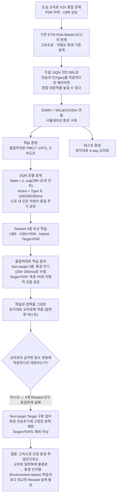

# Graduation-Project

This space is for organizing the MATLAB codes I used while working on my graduation project (졸업논문/종합설계). If you want to see the full thesis, open `졸업논문_2019048440_최윤석_최종.pdf` in this repo.

> **교차로 환경 분산 혼잡 제어를 위한 DQN 심층 강화학습 모델**
> DQN-Based Deep Reinforcement Learning Approach to Distributed Congestion Control in Intersection Environments — 최윤석, 한양대학교 미래자동차공학과

---

## 1. Background & Objectives

**Context.** 도심 교통량이 늘면서 V2X(Vehicle-to-Everything) 통신에서 채널 혼잡이 빈번해지고, 이로 인해 패킷 수신률(PDR)은 떨어지고 채널 점유율(CBR)은 올라가는 문제가 발생한다. Autonomous Driving/ITS의 안정성을 위해 신뢰성 있는 V2X 통신 확보가 중요한 이유다.

**Problem.** 가장 널리 쓰이는 ETSI Rule-Based DCC(Distributed Congestion Control)는 CBR 임계값(0.65)에 따라 전송 주기(Tgen)를 계단식으로 조절하는 단순하고 안정적인 방식이지만, 유럽 고속도로처럼 밀도 변화가 완만한 환경을 전제로 설계되었다. 국내 도심 교차로처럼 밀도 변화가 크고 정체가 불규칙한 환경에서는 이 정적 기준이 실제 혼잡 수준을 제대로 반영하지 못한다는 한계가 있다.

**Goal.** 이 한계를 보완할 수 있는 DQN(Deep Q-Network) 기반 심층 강화학습 모델을 고속도로 시나리오(올림픽대로 PM 시간대)에서 학습시키고, 이를 학습되지 않은 교차로 환경(장지대로)에 그대로 적용했을 때 정책이 일반화되는지, 그리고 보상(Reward) 구조가 이 일반화 성능에 어떤 영향을 미치는지를 검증한다.

## 2. Methodology

### 2.1 핵심 제어 메커니즘 — "도로 단위의 공동 주기 선택"

이 프로젝트에서 강화학습 에이전트는 차량 한 대 한 대에 개별적으로 행동을 배정하지 않는다. 대신 **하나의 도로(시뮬레이션 구간) 전체를 하나의 상태로 요약**해서(차량 밀도 ρ, 평균 CBR) 에이전트가 **전송 주기(Tgen) 하나를 선택**하고, 그 도로 위에 있는 **모든 차량이 동일한 이 주기를 공유**하는 구조다. 즉 "차량마다 다른 100/200/300ms를 고르는" 멀티에이전트 문제가 아니라, "도로 하나 = 상태 하나 = 행동 하나"로 단순화한 싱글 에이전트 문제로 정의되어 있다 (`myDCResetFunction_*.m`, `myDCStepFunction_*.m`).

- **State**: `s_t = [ρ_t, CBR_t]` — 도로 전체의 차량 밀도와 평균 채널 점유율
- **Action**: `A = {100ms, 200ms, 300ms}` — ETSI DCC와 동일한 3단계 전송 주기. 도로 안의 모든 차량이 이 중 하나를 공동으로 선택해 그 주기로 메시지를 생성
- **Reward**: 아래 4가지 구조 중 하나로 계산, 선택된 주기에서의 평균 PDR/CBR을 기준으로 보상 산출

### 2.2 Reward 설계 (4가지 비교)

| Reward 구조 | 정의 |
|---|---|
| CBR 기반 | `−(avgCBR − 0.7)²` |
| CBR+PDR 기반 | `0.7·PDR − 0.3·avgCBR` |
| Hybrid (CBR+PDR+ΔPDR) | `0.7·PDR − 0.3·avgCBR − 0.2·|ΔPDR|` |
| Target-PDR 기반 | `−1000·|PDR − PDR_target|`, `PDR_target = 0.85` |

동일한 DQN 구조에서 Reward만 바꿔가며 정책의 선택 경향성, 안정성, 환경 일반화 성능 차이를 비교했다.

### 2.3 시뮬레이션 환경

SUMO(도로망·교통 흐름)와 WiLabV2XSim(LTE-V2X Mode 4 SB-SPS 통신 모델)을 연동해 구성했다.

- **학습 환경 — 올림픽대로 (고속도로, 강일IC→암사대교 남단)**: 신호등이 없고 병합·분기가 거의 없는 단일 방향 고속화도로로, WiLabV2XSim이 전제하는 도로 모델과 정합성이 높아 밀도–CBR–PDR 관계를 안정적으로 추출하기에 적합했다. AM/MID/PM 세 시간대 중 혼잡 차이가 뚜렷한 **PM(17~19시)** 데이터를 학습에 사용했다.
- **테스트 환경 — 장지대로 교차로 (도심, 4-way 십자교차로)**: 교차로 자체의 정지-출발, 큐 형성 같은 세부 특성을 정밀 재현하기보다, 구조가 다른 환경에서 학습한 정책이 얼마나 일반화되는지 평가하는 것이 목적이라 단순화된 십자형 교차로로 구성했다.
- **통신 파라미터**: 메시지 크기 300 Bytes, 대역폭 10 MHz, 3GPP TR 36.885 기준을 따름.

### 2.4 학습 절차

학습은 올림픽대로 PM 시나리오에서만 수행된다. DQN이 상태(ρ, CBR)를 받아 도로 전체에 적용할 Tgen을 선택하고, 결과 PDR/CBR로 계산된 보상을 바탕으로 Q값을 업데이트한다(Replay buffer, ε-greedy, target network 등 표준 DQN 구성 사용). 학습이 끝난 정책을 그대로 교차로(장지대로) 환경에 적용해 일반화 성능을 테스트한다.

## 3. 연구 흐름 (Flowchart)

이 논문이 문제 제기부터 결론까지 어떤 사고 흐름으로 진행되는지를 요약하면 다음과 같다.

## 4. Research Results

- **올림픽대로 학습 (Non-target Reward: CBR / CBR+PDR / Hybrid)**: 세 Reward 모두 특정 전송 주기(주로 200ms 또는 300ms)로 정책이 수렴하는 공통 경향을 보였다. 상대적 지표(CBR, PDR, ΔPDR)만 반영하다 보니 혼잡 상황을 세밀히 구분해 조절하기보다 하나의 일관된 행동을 강화하는 방향으로 학습된 것으로 해석된다. 밀도가 높아지는 구간에서는 모든 모델에서 PDR 급락과 CBR 급등이 동시에 나타났다.
- **올림픽대로 학습 (Target-PDR Reward)**: 목표 PDR(0.85)과의 오차를 직접 줄이는 절대적 목표 기반 구조라, Non-target Reward에서 나타난 "특정 주기 고정" 현상 없이 목표값에 다가가기 위해 전송 주기를 지속적으로 조정하는 가장 뚜렷한 적응적 제어 특성을 보였다.
- **장지대로 교차로 테스트**: 기대와 달리 Target-PDR Reward를 포함한 4개 Reward 구조 모두, 교차로의 급격한 밀도 변동 구간에서 상황에 맞게 전송 주기를 조절하지 못하고 특정 주기에 고정된 정책을 유지했다. 학습 환경에서 보였던 Target Reward의 적응력은 교차로처럼 학습 시 보지 못한 비정형 혼잡 패턴 앞에서는 재현되지 않았고, 결과적으로 PDR·CBR 곡선이 Non-target Reward 모델과 거의 동일한 형태로 나타났다.

## 5. Conclusion

고속도로 기반으로만 학습한 DQN 정책은 보상 구조(CBR / CBR+PDR / Hybrid / Target-PDR)와 무관하게 교차로처럼 급격한 밀도 변동이 있는 환경에는 일반화되지 않았다. 즉 **Reward 설계를 정교화하는 것만으로는 학습·테스트 환경 간 구조적 차이를 극복할 수 없으며**, 도심 교차로 등 다양한 실제 조건에서 견고한 V2X 혼잡 제어를 달성하려면 환경 인지형(environment-aware) 학습과 더 표현력 있는 보상 모델링이 필요하다는 점을 시사한다.

## 6. 파일 구성

| 파일 | 설명 |
|---|---|
| `WiLabV2Xsim.m` | 시뮬레이터 진입점 — 파라미터 초기화, 시나리오 로드, KPI(PDR/CBR 등) 출력 |
| `mainV2X.m` | 이벤트 기반 메인 시뮬레이션 루프 (패킷 생성, 전송/수신, CBR 갱신, 포지션 갱신 이벤트 처리) |
| `mainInit.m` | 시뮬레이션 초기화 (차량 상태, 채널·자원 할당, 패킷 큐 등 초기값 설정) |
| `mainPositionUpdate.m` | 매 스텝 차량 위치·인접 차량(neighbor) 정보 갱신 |
| `myDCResetFunction_final_90.m` / `myDCStepFunction_final_90.m` | Non-target Reward(CBR·CBR+PDR·Hybrid) 계열 강화학습 환경의 reset/step 함수 |
| `myDCResetFunction_final_dqn_85.m` / `myDCStepFunction_final_dqn_85.m` | Target-PDR Reward(PDR_target=0.85) 기반 강화학습 환경의 reset/step 함수 |
| `myDCResetFunction6_revise.m` / `myDCStepFunction6_revise.m` | 초기 개발·검증 단계에서 사용한 이전 버전의 reset/step 함수 |
| `졸업논문_2019048440_최윤석_최종.pdf` | 졸업논문 원문 |
| `종합설계_포스터발표_2019048440_최윤석.pdf` | 종합설계 포스터 발표 자료 |

## References

1) Sepulcre, M., Mittag, J., Santi, P., Hartenstein, H., & Gozalvez, J. (2011). Congestion and awareness control in cooperative vehicular systems. *Proceedings of the IEEE*, 99(7), 1260-1279.

2) Autolitano, A., Reineri, M., Scopigno, R. M., Campolo, C., & Molinaro, A. (2014, November). Understanding the channel busy ratio metrics for decentralized congestion control in VANETs. In *2014 International Conference on Connected Vehicles and Expo (ICCVE)* (pp. 717-722). IEEE.

3) A. Festag, "Cooperative intelligent transport systems standards in Europe," in *IEEE Communications Magazine*, vol. 52, no. 12, pp. 166-172, December 2014.

4) Balador, A., Cinque, E., Pratesi, M., Valentini, F., Bai, C., Gómez, A. A., & Mohammadi, M. (2022). Survey on decentralized congestion control methods for vehicular communication. *Vehicular Communications*, 33, 100394.

5) Ye, H., Li, G. Y., & Juang, B. H. F. (2019). Deep reinforcement learning based resource allocation for V2V communications. *IEEE Transactions on Vehicular Technology*, 68(4), 3163-3173.

6) Yoon, Y., Lee, H., & Kim, H. (2023). Deep reinforcement learning‐based dual‐mode congestion control for cellular V2X environments. *Electronics Letters*, 59(20), e12984.

7) Hwang, J., & Lee, S. (2020). Balancing power and rate control for improved congestion control in cellular V2X communication environments. *IEEE International Conference on Information and Communication Technology Convergence (ICTC)*, 469-474.

8) European Telecommunications Standards Institute. (2021). ETSI TS 103 574 V1.1.1: Intelligent Transport Systems (ITS); LTE-V2X; Distributed Congestion Control (DCC) framework. ETSI.

9) Todisco, V., Bartoletti, S., Campolo, C., Molinaro, A., Berthet, A. O., & Bazzi, A. (2021). Performance analysis of sidelink 5G-V2X Mode 2 through an open-source simulator. *IEEE Access*, 9, 145648-145661.

10) 3rd Generation Partnership Project. (2020). 3GPP TR 36.214 V18.0.0: Evolved Universal Terrestrial Radio Access (E-UTRA); Physical layer measurements. 3GPP.

11) Mnih, V., Kavukcuoglu, K., Silver, D., Graves, A., Antonoglou, I., Wierstra, D., & Riedmiller, M. (2013). Playing atari with deep reinforcement learning. *arXiv preprint arXiv:1312.5602*.

12) Liu, M., Quan, W., Yu, C., Zhang, X., & Gao, D. (2021, September). Deep reinforcement learning based adaptive transmission control in vehicular networks. In *2021 IEEE 94th Vehicular Technology Conference (VTC2021-Fall)* (pp. 1-5). IEEE.

